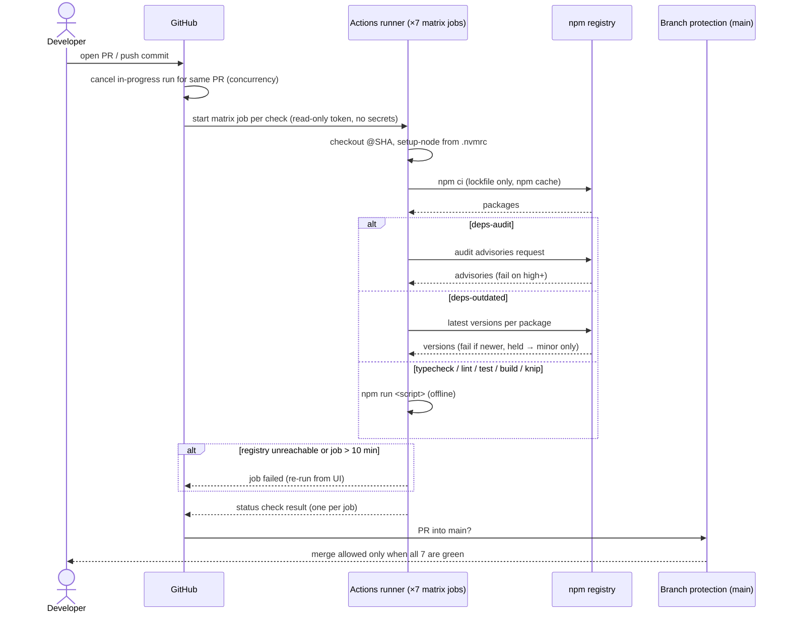

# Design

## Context

- The only enforcement today is local Husky hooks: `pre-commit` runs `typecheck && lint && lint-staged`, and `pre-push` runs `test:coverage && npm audit --audit-level=high`. The repository has no `.github/` directory.
- Baseline on `main` (2026-09-29): typecheck, lint with `--max-warnings 0`, tests with coverage, build, and `npm audit --audit-level=high` all pass. `npm outdated` lists 7 packages: `next` and `eslint-config-next` 16.3.6 → 16.3.7; `react` and `react-dom` 19.2.8 → 19.3.0; `typescript` 5.9.3 → 7.0.2; `eslint` 9.39.5 → 10.11.0; `@types/node` 24.19.0 → 26.6.3.
- The build needs no secrets. With the Contentful variables unset, `getHomeGreeting()` returns a `config` failure and the home page renders the `siteConfig` fallback (FR-7 of `add-contentful-home-greeting`).
- The harness denies every agent `npm install`. The user runs installs and version bumps, so tasks that change `package.json` dependencies start with a manual step.
- `opsx-apply-git` opens pull requests into parent feature branches as well as into `main`, which is why CI runs for every base branch (FR-1).
- Local Node is 24.16.0.

## Goals / Non-Goals

**Goals:**
- One workflow file, where each check is one npm script and one status check.
- Checks behave identically in CI and locally (NFR-3).
- The first CI run on the implementation PR is green.

**Non-Goals:**
- Deployment, preview environments, and the Contentful webhook (a later change).
- Caching `.next/` build output between runs. Builds take well under a minute today.
- Running the new knip and outdated checks in the Husky hooks. CI is where they block. Locally they're available as scripts.
- Branch protection on feature branches. Only `main` is protected (FR-10).

## Decisions

### D1 — One workflow, one matrix job per check

`.github/workflows/ci.yml` defines a single job, `check`, with a `strategy.matrix.include` list of `{ name, script }` pairs and `fail-fast: false`. The job's `name: ${{ matrix.name }}` makes each entry its own status check (FR-9):

| Status check | npm script |
| --- | --- |
| `typecheck` | `typecheck` |
| `lint` | `lint` |
| `test` | `test:coverage` |
| `build` | `build` |
| `knip` | `knip` |
| `deps-audit` | `deps:audit` |
| `deps-outdated` | `deps:outdated` |

Every matrix job runs the same steps: checkout, `setup-node` (from `.nvmrc`, with the built-in npm cache), `npm ci`, then `npm run ${{ matrix.script }}`.

- **Alternative: one job, sequential steps.** Rejected: the first failing step hides every later result (violates FR-9) unless every step uses `continue-on-error`, and then the job's own status is misleading.
- **Alternative: seven hand-written jobs.** Rejected: the same five steps repeated seven times. The matrix states the only thing that differs.
- **Cost:** seven `npm ci` runs per CI run. The npm cache makes each one short, and Actions minutes are free for a public repository.

### D2 — Workflow-level settings

- Triggers: `pull_request` (no branch filter) and `push` with `branches: [main]` (FR-1). A push to a feature branch with an open PR is covered by that PR's `pull_request` run, so feature-branch pushes don't also trigger a `push` run.
- `permissions: contents: read` at workflow level, and no `secrets.*` anywhere (NFR-1).
- `concurrency: { group: ci-${{ github.event.pull_request.number || github.ref }}, cancel-in-progress: true }` (NFR-4).
- `timeout-minutes: 10` on the job, which applies to every matrix entry (NFR-5).
- `actions/checkout` and `actions/setup-node` are pinned to full commit SHAs, each with a `# vX.Y.Z` comment (NFR-2). The SHAs are looked up from each action's latest release when the file is written.

### D3 — Lint fails on warnings: change the `lint` script itself

`"lint": "eslint --max-warnings 0"`. CI and pre-commit both run `npm run lint`, so a warning blocks locally as well as in CI (NFR-3). `lint-staged` keeps its own `eslint --fix` and is unaffected.

- **Alternative: a separate `lint:ci` script.** Rejected: a check that passes locally and fails in CI is exactly the drift NFR-3 exists to prevent.
- Baseline: 0 warnings today, so nothing breaks.

### D4 — Dead code: knip

A `devDependency` with a committed `knip.jsonc`, and `"knip": "knip"`. Knip auto-enables its Next.js, Vitest, ESLint, and PostCSS plugins from `package.json`, so the config stays small: at most `entry`/`project` overrides and `ignore*` lists. It never sets `rules` or `include`/`exclude` to switch an issue type off (FR-6: every default issue type fails CI). The JSONC format lets every ignore entry carry its reason as a comment on the line above it (FR-6). If the installed knip version doesn't read `knip.jsonc`, fall back to `knip.ts`, which also allows comments. The harness's `dead-code-report` skill already uses knip, so this reuses the same tool rather than adding a second one.

First-run findings are triaged in their own task: remove what is truly unused, and ignore with a reason what is used in a way knip can't see (for example `@fission-ai/openspec`, invoked only through `npx openspec`).

### D5 — Outdated check: `npm-check-updates` with a hold list

A `devDependency`, with `"deps:outdated": "ncu --errorLevel 2"`. `--errorLevel 2` exits non-zero whenever any upgrade is available (FR-8). The hold list lives in `.ncurc.cjs`, a JS config so each entry carries its reason as a comment:

```js
// Packages held to their current major; only minor/patch releases count as outdated for them.
const HELD_TO_CURRENT_MAJOR = {
  // Types must match the Node runtime in .nvmrc (24), not the newest Node. Bump together with .nvmrc.
  "@types/node": true,
  // TS 7 is blocked by typescript-eslint's peer range (typescript <6.1.0) as of 2026-09-29. 6.0.x fits that range,
  // but the user chose to stay on 5 rather than take a partial step (2026-09-29). See docs/deferred.md.
  typescript: true,
  // ESLint 10 is blocked by eslint-plugin-react/-import/-jsx-a11y peer ranges (eslint ≤9) as of 2026-09-29. See docs/deferred.md.
  eslint: true,
};

module.exports = {
  target: (name) => (HELD_TO_CURRENT_MAJOR[name] ? "minor" : "latest"),
};
```

- ncu keeps a range's precision: a major-only range such as `^19` is reported only when a new major appears, never for in-major releases. So D8 pins every major-only range to a full `^x.y.z` floor, and a full-precision range is the convention from then on.
- ncu compares each `package.json` range's declared version against the registry. So a caret range whose floor is below the latest release counts as outdated even when the lockfile already installs the latest; the fix is `ncu -u` (or bumping the floor by hand). The spec's "declared version" wording follows this behavior.
- **Alternative: `npm outdated`.** Rejected: it exits 1 on any newer release and has no per-package hold.
- **Alternative: a custom script over `npm outdated --json`.** Rejected: about 30 lines of untested code outside `src/` (not covered by the coverage gate), rebuilding what ncu's `target` option already does.
- The exact `target` signature and `--errorLevel` semantics are confirmed against ncu's docs (context7) when the config is written.

### D6 — Security audit script

`"deps:audit": "npm audit --audit-level=high"` (FR-7). `.husky/pre-push` calls `npm run deps:audit` in place of the inline command, so the severity threshold lives in one place.

### D7 — Node version

`.nvmrc` contains `24`. `actions/setup-node` reads it with `node-version-file: .nvmrc`, which resolves to the latest 24.x. Pinning only the major keeps security patches flowing without edits. The `@types/node` hold (D5) encodes the same major, and nothing enforces the link, so bumping `.nvmrc` means bumping `@types/node` too. The hold's comment in `.ncurc.cjs` and a line in `CLAUDE.md` both say so.

### D8 — Dependency upgrades and held majors

One group, starting with a manual `npm install` by the user:

- **Minor/patch:** `next` and `eslint-config-next` 16.3.7, `react` and `react-dom` 19.3.0, and every caret floor bumped to its latest in-range version (`ncu -u --target minor`). Every major-only range (`@types/react ^19`, `@types/react-dom ^19`, `tailwindcss ^4`, `@tailwindcss/postcss ^4`, `typescript ^5`, `eslint ^9`) is rewritten to a full `^x.y.z` floor, so ncu sees its in-major releases (D5). All of this is low risk, verified by the full local validation.
- **Majors held, not upgraded.** As of 2026-09-29 neither major installs within supported peer ranges. `typescript-eslint` (pulled in by `eslint-config-next/typescript`) declares `typescript >=4.8.4 <6.1.0`. `eslint-plugin-react@7.37.5`, `eslint-plugin-import@2.32.0` and `eslint-plugin-jsx-a11y@6.10.2` (pulled in by `eslint-config-next`) declare ESLint 9 at most. `eslint-config-next`'s own `eslint >=9` range is not the constraint. TypeScript 6.0.3 does fit `typescript-eslint`'s range; the user chose to hold at 5 rather than take that partial step. So `typescript` and `eslint` join the hold list (D5), with the blocking peer named in each reason, and a `docs/deferred.md` entry for each. The user decided this on 2026-09-29 after Gate 1, reversing the earlier "upgrade here" choice once the peer conflict was confirmed.
- **Retry path:** once `npm view <peer> peerDependencies` shows support, delete the hold line. `deps-outdated` then goes red, and the upgrade happens as its own change. Installing with `--force`, `--legacy-peer-deps`, or an `.npmrc` override is never an acceptable way to get green.

`@types/node` stays on 24 (D5, D7).

### D9 — Branch protection (manual)

After the implementation PR merges, the user adds a rule for `main` (GitHub → Settings → Branches, or a ruleset) with these settings: require a pull request before merging, with zero required approvals (a solo developer can't approve their own PR); require every one of the seven status checks to pass, with "require branches to be up to date" left off; and no bypass for anyone. On a ruleset that means an empty bypass list. On classic branch protection it means "Do not allow bypassing the above settings" is on. The developer merges PRs into `main` by hand. No workflow or agent merges there (the user's decision, 2026-09-29). This is manual because the workflow token is read-only by design (NFR-1), and a token with admin scope isn't justified for a one-time setting.

### Sequence — pull request check run (boundary crossing: GitHub → runner → npm registry)



## Risks / Trade-offs

- [A new upstream release of any unheld package turns every open PR red, even if the PR didn't touch dependencies] → The user accepted this (blocking chosen over informational). The fix is a one-line bump, or a hold with a reason. The failing job's output names the package.
- [The two network-dependent checks (`deps-audit`, `deps-outdated`) can fail on a registry outage, not a code problem] → They are separate status checks, so the cause is visible. Re-run the job.
- [TypeScript and ESLint fall a major behind while held] → Each hold names its blocking peer and has a `docs/deferred.md` entry. Their in-major releases are still enforced. Retrying is deleting one line (D8).
- [A held package's peer blocker clears and nobody notices] → Accepted: nothing polls for it. `docs/deferred.md` is read before every new change is proposed (CLAUDE.md), which surfaces the entries.
- [`--max-warnings 0` in pre-commit blocks commits over a warning] → Intended (NFR-3). Baseline is 0 warnings.
- [SHA-pinned actions don't pick up security fixes automatically] → Accepted for a portfolio project without Dependabot. The version comment beside each SHA makes a manual bump easy to review.
- [knip false positives on framework conventions (Next.js route files, config files)] → Its Next.js plugin knows the App Router entry points. The rest are ignored with a documented reason (D4).
- [Seven parallel `npm ci` runs] → Cheap on public-repo runners. It's the price of independent status checks (FR-9).

## Migration Plan

1. The implementation PR itself carries the workflow, so its own run is the first proof. All seven checks must be green before merge.
2. After it merges, the user configures branch protection on `main` (D9) and confirms that a throwaway PR with a failing check is blocked with no bypass and that a direct push is rejected (tasks group 7).
3. Rollback: delete `.github/workflows/ci.yml` and the branch protection rule. Scripts, configs, and upgrades are independent and can stay.
