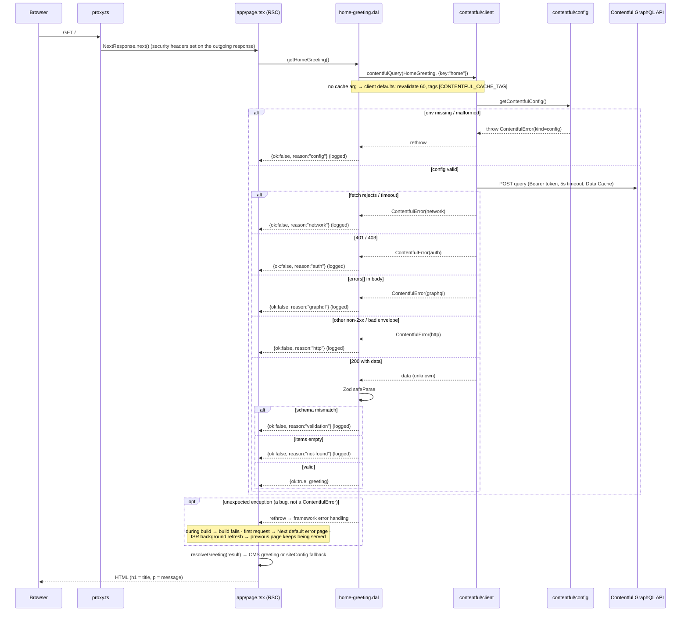

# Design

## Context

See `proposal.md` for motivation and the numbered requirements (FR-1…FR-9, NFR-1…NFR-3).

Current state:
- `src/app/page.tsx` is an async Server Component that renders `siteConfig.name` / `siteConfig.description` as the heading and prefetches poems into TanStack Query. The route is fully static (`○` in `next build`).
- No server-only code or external services exist yet. `features/poems/api/poems.api.ts` returns in-memory mock data.
- Next.js 16: `middleware.ts` is renamed `proxy.ts` (export `proxy`); with the `src/` layout it lives at `src/proxy.ts`. `cacheComponents` is **not** enabled, so `fetch(…, { next: { revalidate, tags } })` is the caching mechanism.
- Zod 4 is installed. The harness denies package installs, so `server-only` is installed by the user.
- Architecture rules (CLAUDE.md): `app/` stays thin; features are imported only through `index.ts` (enforced by ESLint); `shared/` never imports from `features/`.

## Goals / Non-Goals

**Goals:**
- One reusable, server-only path to Contentful that later content (poems, authors) can use unchanged.
- Validate at every trust boundary: env config on the way in, the response on the way back.
- The home page never breaks because of the CMS.

**Non-Goals:**
- Preview/draft mode, the Content Preview API, or a second token.
- Webhook signature verification with Contentful's request-signing feature (the shared-secret header is enough for now), and per-entry or per-content-type invalidation (one tag expires all CMS content).
- Moving poems to Contentful; rich text; images; localisation.
- A Content Management API script to create the content type (you create it in the UI).
- A Content Security Policy header (needs nonces and interacts with Next's inline scripts; separate change).
- GraphQL code generation (a single query doesn't justify the toolchain).

## Decisions

### D1 — Module layout

```
src/
├── proxy.ts                                # FR-8 security headers
├── app/api/revalidate/route.ts             # FR-9 webhook endpoint (thin: verify → revalidateTag)
├── shared/lib/contentful/                  # generic, content-agnostic
│   ├── config.ts        getContentfulConfig()  → ContentfulConfig | throws ContentfulError(kind="config")
│   ├── errors.ts        ContentfulError (discriminated by `kind`)
│   ├── client.ts        contentfulQuery(query, variables, cache?) → Promise<unknown>
│   ├── webhook.ts       verifyWebhookSecret(headerValue) → "ok" | "unauthorized" | "not-configured"
│   └── index.ts         public surface of the lib (+ CONTENTFUL_CACHE_TAG, ContentfulErrorKind)
└── features/home/                          # the home greeting feature
    ├── model/greeting.schema.ts        Zod schemas (fields `trim().min(1)`) + `Greeting` type (z.infer)
    ├── model/greeting.types.ts         `GreetingResult` (type-only imports, no runtime deps)
    ├── model/resolve-greeting.ts       result → Greeting (applies static fallback), pure
    ├── api/home-greeting.dal.ts        getHomeGreeting() → GreetingResult   ("server-only")
    ├── components/HomeGreeting/HomeGreeting.tsx   presentational heading + message
    └── index.ts
```

- `shared/lib/contentful` knows nothing about greetings: it validates config, executes a query, and returns the GraphQL `data` as `unknown`. **Why:** that keeps it reusable, and it forces every caller to validate with its own schema (FR-4), so no call site can skip validation.
- **Exception to "no `shared/` until a second consumer":** content-agnostic infrastructure clients (like `shared/lib/query-client.ts`) belong in `shared/lib` from their first consumer; the rule targets domain abstractions. The CLAUDE.md update records this.
- Dependency direction inside the feature is `api/ → model/`, never the reverse. `Greeting` and `GreetingResult` live in `model/`; `model/` imports from `shared/lib/contentful` only with `import type`, so it stays pure and has no server-only runtime dependency.
- The DAL lives in the feature (`api/*.dal.ts`), next to the schema it validates against. **This deliberately deviates from the TanStack Query convention:** the greeting is server-only data rendered only by a Server Component, and a client refetch would need the token. The rule recorded in CLAUDE.md: *server-only data consumed only by Server Components goes through a `*.dal.ts` DAL (starting with `import "server-only"`), never `queryOptions` or client hooks.*
- `HomeGreeting` is a synchronous presentational component; `page.tsx` awaits the DAL and passes the resolved greeting down. **Why:** Vitest can't render async Server Components, so this keeps the component unit-testable and leaves the page as thin composition.
- *Alternative considered:* a generic `features/content` or `shared/lib/cms` DAL for all content types. Rejected (YAGNI): there's one content type; extract when a second one lands.

### D2 — GraphQL client: typed `fetch` wrapper (no library)

`contentfulQuery` POSTs `{ query, variables }` to `https://graphql.contentful.com/content/v1/spaces/{spaceId}/environments/{environment}` with `Authorization: Bearer <token>`, a 5-second `AbortSignal.timeout`, and `next: { revalidate, tags }`. The `cache` argument is optional: `revalidate` defaults to 60, and the tags are the caller's tags **plus** `CONTENTFUL_CACHE_TAG`, always de-duplicated. **Why enforced:** the webhook (D10) expires only that tag, so a caller that could drop it would silently fall outside the hard freshness deadline.

- **Why not Apollo / graphql-request:** server-only reads with no client cache; native `fetch` is what Next's Data Cache hooks into, and the wrapper is ~60 lines (NFR-3).
- The response envelope `{ data?: unknown; errors?: { message: string }[] }` is itself parsed with Zod, so a non-JSON or malformed body becomes a typed error rather than a crash. When `errors` is absent or empty, `data` must be a non-null object; otherwise (`{}`, `{ "data": null }`) the body is an invalid envelope → `http` with the actual status (e.g. 200).

### D3 — Error model

`ContentfulError extends Error` with a `kind` discriminant:

| kind | raised when | carries |
|---|---|---|
| `config` | env var missing/malformed (from `getContentfulConfig`) | offending variable **names** |
| `network` | `fetch` rejects or times out | cause |
| `auth` | HTTP 401 or 403 (invalid, revoked or wrong-space token) | status |
| `graphql` | the envelope has a non-empty `errors` array (any status, e.g. 400 on a bad query) | messages |
| `http` | any other non-2xx, or a body that isn't a valid envelope | status |

Checked in this order: network → auth (401/403) → graphql (errors array) → http (other non-2xx / bad envelope). No error message ever includes the token or the request headers (NFR-1).

The DAL returns a discriminated result instead of throwing, so the page can't forget to handle a failure:

```ts
// shared/lib/contentful exports: type ContentfulErrorKind = ContentfulError["kind"]
type GreetingResult =
  | { ok: true; greeting: Greeting }
  | { ok: false; reason: ContentfulErrorKind | "validation" | "not-found" };
```

`reason` derives from the lib's error kinds instead of restating them, so a new kind (e.g. `rate-limit` for 429) flows through without the two lists drifting apart.

The DAL catches `ContentfulError` (mapping `kind` → `reason`), runs `safeParse` for `validation`, and treats empty `items` as `not-found`. Anything else (a programming bug) is re-thrown, not swallowed. Each failure is logged once on the server as `console.error("[contentful] home greeting failed", { reason, status? })`, with no payloads and no secrets.

### D4 — Config / token validation

`getContentfulConfig()` parses `process.env` with Zod:
- `CONTENTFUL_SPACE_ID`: non-empty, `^[a-z0-9]+$`
- `CONTENTFUL_ACCESS_TOKEN`: non-empty, no whitespace
- `CONTENTFUL_ENVIRONMENT`: optional; unset **or empty** → `master` (an empty value from a copied `.env.example` must not produce `…/environments/`); a non-empty value must match `^[a-zA-Z0-9_.-]+$`, otherwise `config`

It's read lazily on each call, not at module load. **Why:** a module-load throw would crash `next build` and every test that imports the module. Format validation catches copy-paste mistakes locally; whether a token is actually valid is only knowable from Contentful's 401 (the `auth` kind).

### D5 — Server-only enforcement

Every file in `shared/lib/contentful/` and the DAL starts with `import "server-only"` (FR-1): importing them from a Client Component fails the build. Vitest aliases `server-only` to an empty stub (`vitest.config.mts` → `resolve.alias`), so the modules are unit-testable in jsdom/node.

### D6 — Caching and the fallback

- **Freshness has two paths (NFR-2).** The *hard 60 s deadline* is met by the publish webhook (D10), which expires the tag with `{ expire: 0 }` so the next request blocks on fresh data. The *time-based* 60 s revalidation is only a safety net for a missed webhook. It uses Next's stale-while-revalidate, so one request after expiry can still get the stale copy. Time-based settings can't meet a hard deadline on their own, which is why the webhook is part of this change.
- The DAL relies on the client defaults (60 s revalidate, the `contentful` tag always applied). The constant `"contentful"` is exported once from `shared/lib/contentful`, so the webhook's `revalidateTag` and every future DAL share one definition. `page.tsx` also exports `revalidate = 60`. **Why the page-level export too:** if the config is missing at build time the DAL never calls `fetch`, so without a page-level revalidate the fallback would be baked into a static page permanently. With it, the page self-heals on the safety-net path once the env vars exist.
- Fallback (FR-7): `resolveGreeting(result)` returns the CMS greeting on success, otherwise `{ title: siteConfig.name, message: siteConfig.description }`. The build **doesn't** fail on missing env: a missing CMS shouldn't take the site down, and the loud signal is the server log (plus the page visibly showing the old copy).

### D7 — Content model (manual recipe)

In the Contentful web app (Content model → Add content type):
- Name `Greeting`, API identifier **`greeting`**
- Fields:
  - `key`: Short text, required, unique
  - `title`: Short text, required
  - `message`: Long text, required. Set its appearance to **Multiple line** (not the default Markdown editor): it renders as plain text. Blank lines separate paragraphs and single line breaks are kept (`HomeGreeting` splits on `/\n\s*\n/` into `<p>`s and uses `whitespace-pre-line`). Markdown shows literally.

Then add an entry with key `home`, title `Welcome to Poetry Hub`, and message `Discover, read, and collect poems — from timeless classics to voices you haven't met yet.`, and **publish** it. The API id `greeting` yields the GraphQL field `greetingCollection`:

```graphql
query HomeGreeting($key: String!) {
  greetingCollection(where: { key: $key }, limit: 1) {
    items { key title message }
  }
}
```

### D8 — Proxy

`src/proxy.ts` returns `NextResponse.next()` with four headers (FR-8):
- `X-Content-Type-Options: nosniff`
- `Referrer-Policy: strict-origin-when-cross-origin`
- `X-Frame-Options: DENY`
- `Permissions-Policy: camera=(), microphone=(), geolocation=()`

Matcher: `/((?!_next/static|_next/image|favicon.ico|.*\..*).*)`. The `.*\..*` part excludes **any** path containing a dot, dotted page slugs included (for example `/poems/mr.smith`); that's accepted, and slugs must not contain dots. Poem slugs from a future CMS-backed route need to follow that rule. Headers are defined in one exported constant so tests assert against the same source.

*Alternative considered:* `headers()` in `next.config.ts`. It works for static headers, but you asked for a proxy, and the proxy is where request-aware logic (auth, i18n, CSP nonces) will go later.

### D9 — Env documentation

`.env.example` (committed) lists `CONTENTFUL_SPACE_ID`, `CONTENTFUL_ACCESS_TOKEN` and `CONTENTFUL_REVALIDATE_SECRET` with empty values, and `CONTENTFUL_ENVIRONMENT=master`: the one non-secret default, shown explicitly. The create-next-app `.gitignore` ignores `.env*`, so a `!.env.example` exception is added.

### D10 — Publish webhook: `POST /api/revalidate` (FR-9)

- **Route handler** `src/app/api/revalidate/route.ts` exports only `POST`, so Next answers 405 for other methods. It stays thin: it reads the `x-contentful-webhook-secret` header, calls `verifyWebhookSecret`, and maps the outcome:
  - `ok` → `revalidateTag(CONTENTFUL_CACHE_TAG, { expire: 0 })` → 200 `{ revalidated: true }`
  - `unauthorized` → 401
  - `not-configured` → 503, logged
- **`{ expire: 0 }`, not `'max'`:** Next 16's recommended `'max'` profile serves stale content while refreshing, which would break the hard deadline. `{ expire: 0 }` makes the next request a blocking cache miss (per the `revalidateTag` docs; `updateTag` works only inside Server Actions).
- **Secret check** (`shared/lib/contentful/webhook.ts`, `import "server-only"`): read `CONTENTFUL_REVALIDATE_SECRET` lazily; an unset or empty secret → `not-configured`, which **fails closed** (it never accepts, even an empty header). Compare with `crypto.timingSafeEqual` over SHA-256 digests of both values, so differing lengths don't leak through timing or throw. The secret is never logged or echoed.
- **Why a shared-secret header:** Contentful webhooks support custom headers, and one header check is the simplest thing that stops anonymous cache-busting. Request signing is stronger (replay protection) but adds a dependency and a second secret format (see Non-Goals).
- **Why the endpoint isn't in `features/home`:** it invalidates *all* Contentful content via one tag, so it belongs to the CMS infrastructure, not the greeting feature.
- **Webhook setup (manual, in Contentful → Settings → Webhooks):**
  - URL: `https://<deployed-host>/api/revalidate`, method POST
  - Triggers: Entry → Publish, Unpublish
  - Custom header: `x-contentful-webhook-secret: <secret>`
  - Contentful can't reach `localhost`, so locally the endpoint is exercised with `curl`.

### Sequence — publish webhook (boundary crossing: Contentful → app)

```mermaid
sequenceDiagram
    participant CF as Contentful (webhook)
    participant R as app/api/revalidate/route.ts
    participant W as contentful/webhook
    participant NC as Next cache
    participant B as Browser
    participant Pg as app/page.tsx (RSC)

    CF->>R: POST /api/revalidate (x-contentful-webhook-secret)
    R->>W: verifyWebhookSecret(header)
    alt secret not configured
        W-->>R: "not-configured"
        R-->>CF: 503 (logged, nothing expired)
    else header missing / wrong
        W-->>R: "unauthorized"
        R-->>CF: 401 (nothing expired)
    else match (constant-time)
        W-->>R: "ok"
        R->>NC: revalidateTag("contentful", { expire: 0 })
        R-->>CF: 200 { revalidated: true }
        B->>Pg: GET /
        Pg->>NC: greeting fetch (tag expired → blocking miss)
        Note over Pg,NC: follows the home-page render sequence below; fresh greeting rendered
        Pg-->>B: HTML with the new greeting
    end
```

### Sequence — home page render (the boundary-crossing flow)



## Risks / Trade-offs

- [The feature barrel re-exports a server-only DAL, so a future client component importing `@/features/home` breaks the build] → Intentional for now (FR-1). If `features/home` gains client components, split server exports into a separate entry point and extend the ESLint boundary rule.
- [The fallback hides misconfiguration] → The failure reason is logged on every render miss; the page shows the old copy, which is visible to anyone checking. Webhook alerts are a later change.
- [The content model drifts (field renamed in Contentful)] → Zod turns it into a `validation` failure plus fallback, not a crash; the log names the reason.
- [Secrets leaking into logs or errors] → Errors carry only kinds, statuses, variable names and GraphQL messages; tests assert the token string never appears in error messages.
- [Contentful rate limits or latency] → The 60 s Data Cache means at most one request per minute per instance; the 5 s timeout bounds render latency.
- [Next may not put an `Authorization`-bearing POST `fetch` into the Data Cache] → Accepted and not verified in this change. Task 9.2 checks only that the *page* is cached (a second load within 60 s returns `x-nextjs-cache: HIT`), which is what bounds Contentful traffic for the home page today. Fetch-level caching matters only once a dynamic route uses the client; if it turns out not to cache, switching to Contentful's GET form (`?query=…&variables=…`) changes only `client.ts`.
- ["The page never breaks because of the CMS" excludes programming bugs] → Only a non-`ContentfulError` exception escapes the fallback (see the `opt` branch in the sequence diagram); an `app/error.tsx` boundary is a separate decision.
- [ISR changes the page from static to revalidated] → Accepted; that's the point of CMS content.
- [A public endpoint that forces cache misses] → It's secret-gated, fails closed when unconfigured, and compares in constant time. A leaked secret only allows cache-busting (more Contentful reads), not content changes. Rotate it by changing the env var and the Contentful webhook header together.
- [The hard deadline depends on webhook delivery] → Contentful retries failed deliveries and logs them in its webhook activity log. If every retry fails, the 60 s safety net still converges, with one possibly stale response. The hard guarantee is only as good as delivery.
- [`revalidateTag(tag, { expire: 0 })` across multiple server instances] → Self-hosted `next start` keeps its cache per instance. The webhook expires only the instance that receives it unless a shared cache handler is configured. That's fine for a single-instance deploy; revisit before scaling out.
- [The webhook can arrive before Contentful's delivery CDN serves the published version] → The refetch right after expiry would then cache the *old* greeting for another 60 s, and the time-based path can serve one more stale response after that. Accepted: NFR-2's hard deadline is stated conditionally on Contentful's delivery API already serving the published version when the notification is processed. If this shows up in practice, the smallest fix is to shorten the safety-net revalidate, a one-number change in the client default. Manual check 9.5 can't catch it, because a hand-run `curl` is naturally slow enough.

## Migration Plan

1. You run `npm install server-only` (the harness blocks agent installs).
2. You create the `greeting` content type and publish the `home` entry (D7).
3. Confirm `.env.local` uses `CONTENTFUL_SPACE_ID`, `CONTENTFUL_ACCESS_TOKEN`, optionally `CONTENTFUL_ENVIRONMENT`, and a newly generated `CONTENTFUL_REVALIDATE_SECRET` (for example `openssl rand -hex 32`); set the same on the hosting platform before deploy.
4. Deploy.
5. After deploy, create the Contentful webhook (D10) pointing at the deployed URL, then check its activity log shows a 200 after publishing an entry.
6. Rollback = revert the change and disable the webhook; the static copy returns, and nothing else depends on Contentful.
