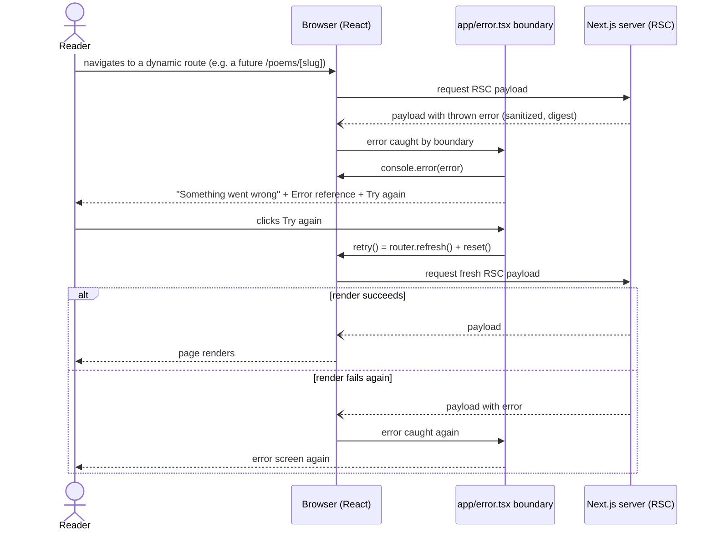
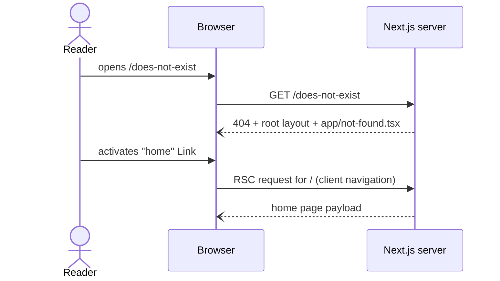

# Design

## Context

The App Router resolves special files per route segment. In the root segment `src/app/`:

- `not-found.tsx` renders for unmatched URLs (with HTTP 404) and for `notFound()` calls in the subtree.
- `error.tsx` wraps the segment's children (not its own `layout.tsx`) in a React error boundary. Next.js 16.3+ passes three props: `error` (`Error & { digest?: string }`; in production, Server Component errors arrive sanitized and carry only `digest`), `reset` (clear the boundary only), and `retry` (`router.refresh()` + `reset()` in one transition, stable since 16.3.0). This project runs `next@16.3.8`.
- `loading.tsx` wraps the segment's page in a `<Suspense>` boundary and renders as its fallback.

`src/app/` is routing-only (`docs/architecture.md`). The three screens hold no business logic, only static copy plus one interaction (retry), so they live directly in the route files. Today there is one page (`/`, ISR with `revalidate = 60`). It awaits `getHomeGreeting()`, which never throws, and `prefetchQuery`, which swallows errors. So the error screen guards future pages more than today's. Keeping it in place is still worthwhile: it is the one place that catches unexpected render errors.

## Goals / Non-Goals

**Goals:** branded, accessible fallbacks for 404, render errors, and loading at the root segment; no leak of internal error messages; one-click recovery.

**Goals (cont.):** `(public)` and `(authorized)` route groups in place, so future routes land in the right group from day one.

**Non-Goals:** `global-error.tsx`, per-segment fallbacks, external error reporting, not-found metadata, and any auth logic (see proposal Out of Scope).

## Decisions

### D1 — Route files only, no new shared component

Each screen is a small JSX tree inside its route file: an `h1`, a paragraph, and an action. The three screens share a visual pattern (centered `main` with heading, text, and action). Extracting a `shared/ui` primitive now would mean an abstraction with three call sites, all in `app/`, and no feature consumer. Per the architecture rule ("don't create a `shared/` abstraction until a second feature needs it") and YAGNI, we inline it and reuse only the existing `Button`.
*Alternative:* `shared/ui/StatusScreen`. Rejected for now; revisit when a feature needs the same layout.

### D2 — `error.tsx` uses `retry`, not `reset`

Root-segment errors are almost always Server Component render failures. `reset()` alone re-renders the same failed RSC payload and fails again. `retry()` refetches from the server first. Only `retry` is wired to the button; `reset` is unused.

### D3 — Never render `error.message`

In production Next.js already replaces Server Component messages with a generic string. But Client Component errors keep their real message in every environment, and dev builds expose server messages. The screen therefore shows fixed copy, plus `digest` when present, because it correlates with server logs and is safe to show. The full error goes to `console.error` in a `useEffect` keyed on `error`, so developers keep the detail.

### D4 — Props typing

`error.tsx` declares an explicit props interface, `{ error: Error & { digest?: string }; retry: () => void }`. It types only what the component uses, in line with the strict-TypeScript rule. If `next` exports an official error-boundary props type in 16.3.8, the implementer may use it instead; `npm run typecheck` is the arbiter.

### D5 — Not-found link uses `next/link`

The home link is a `next/link` `Link` to `/`, so navigation is client-side. It is styled with Tailwind token utilities (`text-accent`, underline on hover). `Button` renders a `<button>`, and navigation belongs on a link, so `Button` is not used here.

### D6 — Loading state: status region + decorative skeleton

`loading.tsx` renders a `main` with the same container classes as `page.tsx`. Inside it are a visually hidden `<span>` "Loading…" in a `role="status"` element, and a few skeleton blocks (`bg-surface rounded animate-pulse motion-reduce:animate-none`) marked `aria-hidden="true"`. The skeleton is deliberately neutral: a heading bar and three text bars. It is not shaped like the home page. `/` is ISR, so readers will mostly see this fallback on future dynamic routes (poem detail, collections), and a home-shaped skeleton would show the wrong layout there. Route-specific skeletons come with segment-level `loading.tsx` files when those routes exist.

### D7 — Tests in `src/app/tests/`

Following `docs/decisions/0002-tests-folder-per-module.md` and the existing `src/app/api/revalidate/tests/` precedent: `src/app/tests/{not-found,error,loading,group-layouts}.test.tsx` (jsdom, Testing Library). `group-layouts.test.tsx` renders each group layout around a marker child and asserts the container holds exactly that child (FR-8). Test files import the layouts by their relative path; the parentheses in folder names are ordinary path characters. `src/app/**` remains excluded from coverage. The tests exist for behavior (FR-3/4/5 especially), not for the threshold. `next/link` renders fine in jsdom without a router for an `href` assertion.

### D8 — Route groups: `(public)` holds `/`, `(authorized)` is a pass-through stub

Target tree:

```
src/app/
├── layout.tsx            # root layout (unchanged): html/body/Providers
├── error.tsx  loading.tsx  not-found.tsx   # cover both groups (root only, user decision)
├── (public)/
│   ├── layout.tsx        # pass-through: returns children
│   └── page.tsx          # moved from src/app/page.tsx, contents unchanged
├── (authorized)/
│   └── layout.tsx        # pass-through; comment: placement marker only, enforces nothing
├── providers.tsx  globals.css  api/
```

- Route groups don't affect URLs, so `/` stays `/`. `page.tsx` only uses `@/` imports, so the move needs no import edits. `export const revalidate = 60` moves with it and keeps its literal-value comment.
- Both group layouts return `children` with no wrapper element. That keeps the DOM, and therefore the rendered home page, identical to today's. Each is typed `{ children: ReactNode }` explicitly instead of `LayoutProps<…>`, because `(authorized)` has no page. Next's typegen may generate no route literal for it, and using the same explicit type in both keeps them symmetric. `npm run typecheck` (which runs typegen) confirms it.
- `(authorized)/layout.tsx` contains no guard, redirect, or session read. A fake guard would be misleading and untestable. The comment says the group is a placement marker that enforces nothing. The future auth change owns enforcement: the proxy, or checks in the DAL/page. A layout-only check is not sufficient. With partial rendering, a shared layout does not re-render on client navigation between sibling pages, so a guard there would run only on hard loads.
- A layout with no page under it is valid in the App Router and adds no route. `npm run build` verifies the route list is unchanged, and knip treats `app/**/layout.tsx` as Next.js entry points.
- *Alternative considered:* empty folders with `.gitkeep`. Rejected because git tracks no structure for them, and a reader can't tell what belongs in each group.
- **Rule documented in `docs/architecture.md`:** a new page goes in `(public)/` unless it needs a signed-in reader, in which case it goes in `(authorized)/`. That group enforces nothing yet, and putting a page there does not protect it. Route handlers under `api/` stay outside both groups.

## Flow — render error and retry



Example route is generic on purpose: `/` is ISR, where a failed revalidation keeps serving the stale page and a throw at build time fails the build, so this flow cannot be reproduced on `/`.

## Flow: unknown URL



## Risks / Trade-offs

- **Root layout errors are not caught** (no `global-error.tsx`). Accepted: the layout is static. Revisit when it gains logic.
- **Error screen is hard to trigger in browser QA**: no route throws today. Mitigation: unit tests cover FR-2..FR-5. For a browser check, Gate 3 uses the Next.js dev tools' segment explorer, which can toggle a segment's error/loading/not-found boundary. If that isn't available, the browser check is limited to not-found and the error screen relies on unit tests, recorded as such in the QA report. No throwaway "throw" route is added to the codebase.
- **Placeholder group with no behavior** (`(authorized)`): a YAGNI trade-off the user chose explicitly to fix the folder structure early. Risk: someone adds a page there assuming it is protected. Mitigation: the layout comment and the `docs/architecture.md` rule both state that the group enforces nothing yet.
- **Loading state rarely visible**: `/` is ISR. Accepted; the file is for future dynamic segments.

## Migration Plan

Additive, except for one file move (`page.tsx` → `(public)/page.tsx`), which does not change URL or behavior. Rollback = move `page.tsx` back to `src/app/` and delete the new files.
